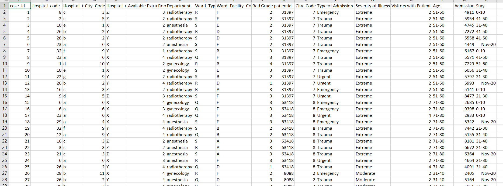
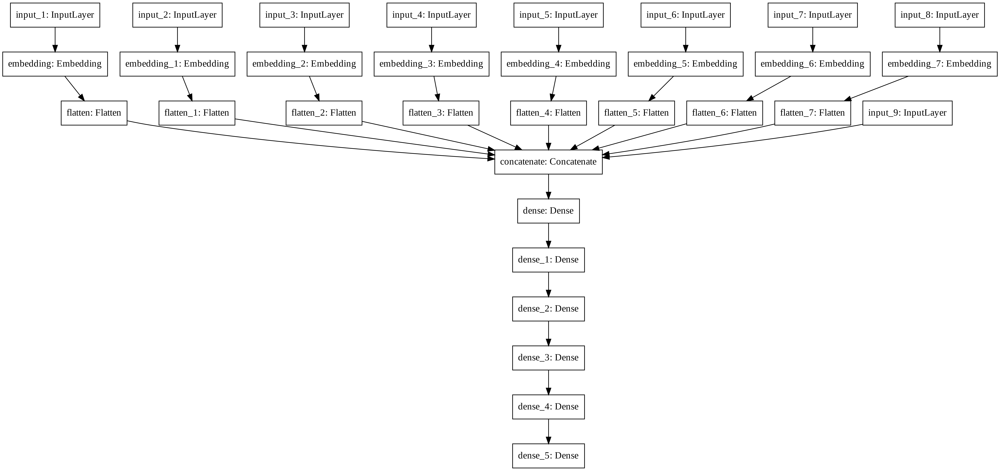

# Disclaimer
The code for this competition is a blending nightmare.

# Data Screenshot

# A Description of our Methodology
### Full Methodology

### Description
The basic idea is to develop a single Neural Network model and then blend its predictions at different epochs. The details and reasoning of how to perform such blending is provided in the readme file of the [All_Blends](https://github.com/atif-hassan/Competition-code/tree/master/AnalyticsVidhya/JanataHack_Healthcare/Code/All_Blends) folder.

Each categorical variable was represented by an embedding layer and a basic lightgbm model's probabilities were stacked (added as features to the NN model).
Very little feature engineering has been performed in this competition though A "super" feature that really worked was finding the co-occurrence matrix of patient_id vs hospital_code. Basically this tells us the frequency of the different hospitals that have been visited by different groups of patients.

### Tools used
1. Python for programming
2. sklearn, tensorflow, keras, numpy, huggingface, lightgbm libraries used

### Team Name: CodeEmPotatoChips ([Ankita Chatterjee](https://www.linkedin.com/in/ankita-chatterjee-8367051b3) & Atif Hassan)

# Competition Result
1. Rank: **5th** on public LB and **9th** on private LB
2. [Link to leaderboard](https://datahack.analyticsvidhya.com/contest/janatahack-healthcare-analytics-ii/#LeaderBoard)
