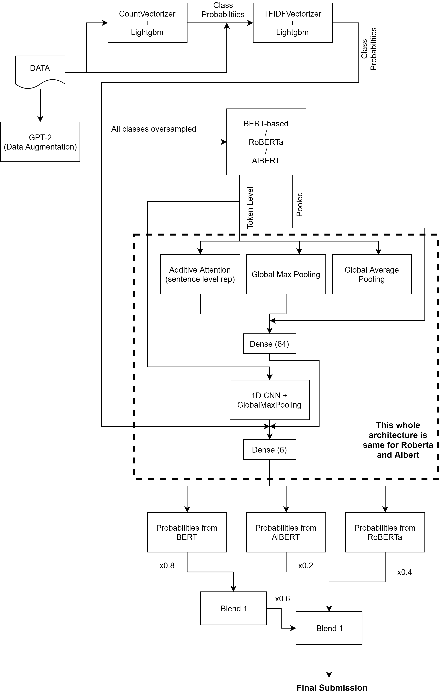

# Data Screenshot

# A Description of my Methodology

### Full Methodology

### Tools used
1. Python for programming
2. sklearn, tensorflow, keras, numpy, huggingface, lightgbm libraries used

### Team Name: CodeEmPotatoChips ([Sayantan Basu](https://www.linkedin.com/in/sayantan-basu-a29861a1) & Atif Hassan with Special thanks to [Devrup](https://www.linkedin.com/in/devrup-b-7b2423107/))

# Competition Result
1. Rank: **1st** on public LB and **1st** on private LB
2. [Link to leaderboard](https://datahack.analyticsvidhya.com/contest/janatahack-independence-day-2020-ml-hackathon/#LeaderBoard)
