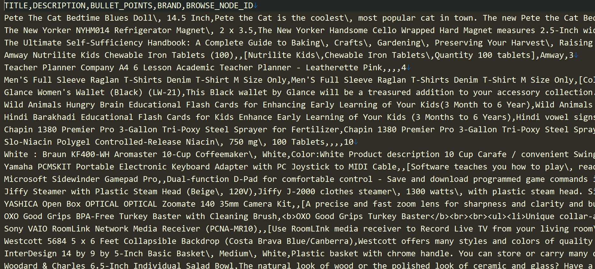
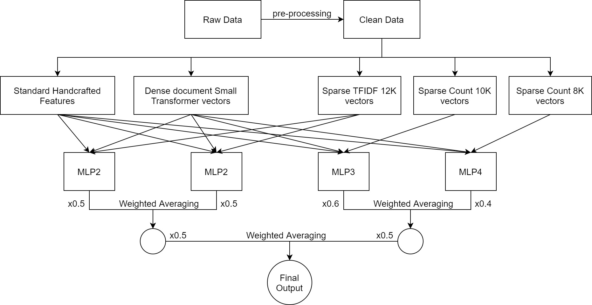

# Data Screenshot

# Problem Statement
Classify products into their respective browse node ids. There are 9K+ classes and the problem is a multi-classification problem.

# A Description of our Methodology

### Feature Engineering & Approach

1. The data was too large so we made a simple train-test split for our validation
2. Standard handcrafted features such as number of words, number sentences, number of adjectives, number of stopwords, etc. were generated. Reason for generating such features is for example, people in the clothing industry might use more industries to describe their product when compared to the toy industry. 
3. Generated sparse TF-IDF and Count vectors
4. Generate Dense Document vectors from small transformer
5. Concatenate 1, 3 and 4 together and pass through different multi-layered perceptrons. Each MLP is 3 hidden-layer network trained for a single epoch.
6. Perform pairwise layered weighted averaing to get final predictions

### Tools used
1. Python for programming
2. sklearn and numpy libraries for methodology
3. Tensorflow library for the final model
4. matplotlib and seaborn was used for plotting and analyzing the data

### Team Name: DarkThunder ([Harshita Gupta](https://github.com/hrsht-13), [Atharva Ingle](https://github.com/Gladiator07), [Ishan Dutta](https://github.com/ishandutta0098) & Atif Hassan)

# Competition Result (Team name: DarkThunder)
1. Rank: **12th** on public and private LB
2. [Link to leaderboard](https://www.hackerearth.com/challenges/competitive/amazon-ml-challenge/leaderboard/)
