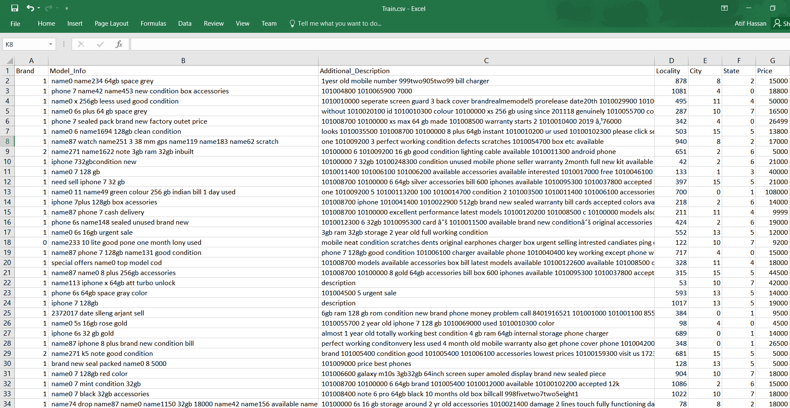

# Data Screenshot

# A Description of my Methodology

I treated this competition as an aspect-based extraction problem. My approach can be summarized in seven separate techniques.
- I thoroughly cleaned the dataset, including a lot of product names that were present in the data without any space separations. I also dropped the City, State and Additional_Description columns.
- Finding out what each number in the brand column represented was the most important part for me in this competition. Once I realized that Brand value of 0 meant the Huawei Honor products, 1 meant apple products, 2 meant Lenovo and 3 meant LG, I built five separate features, one for each brand with the apple products receiving two features (iphone and iwatch). These features were a relative ranking of all the different products based on their costs and ended up being the most important set of features in the final classifier.
- I then went on to engineer five more features, two of which were the amount of ram and rom of each phone mentioned in the dataset, and the other three were boolean features representing whether the phones had warranty on them or not, whether the payment was to be done online or in terms of cash and whether the phone was in working state or not.
- Once my feature engineering was complete, I applied the countvectorizer from sklearn on the model_info column to generate a set of sparse features to represent each sentence.
- I also added the un-normalized sum of idf weighted word vectors as dense representations for each sentence in the model_info column.
- These features alone put me at the 2nd spot with the default catboost (no hyper-parameter tuning).
- Finally, I applied a weighted average of the default catboost and xgboost to achieve the first position.

# Competition Result
1. Rank: 1st
2. [Link to leaderboard](https://www.machinehack.com/course/used-electronics-price-prediction-weekend-hackathon-7/leaderboard)
3. [Analytics India Magazine published an article of the top 3 winners](#)
